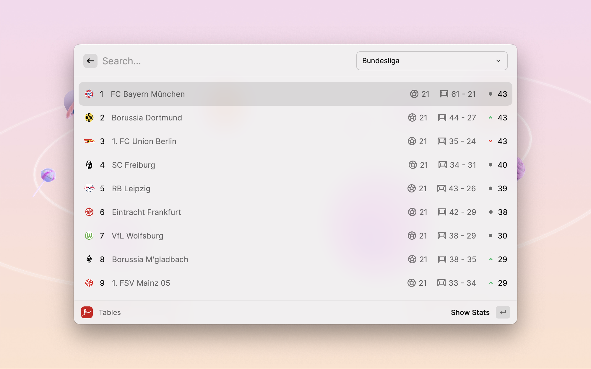

<p align="center">
  <h1 align="center">Bundesliga</h1>
</p>

Stay up-to-date with the latest news, fixtures, results, and standings from the Bundesliga.



**Bundesliga** is an extension designed to provide a comprehensive and convenient experience for Bundesliga fans. It offers a range of features, including:

* **Club Information:** Detailed profiles of Bundesliga clubs, including their history, recent results, and key players.
* **Fixtures & Results:** Up-to-date schedules and results for all Bundesliga matches.
* **Standings:** Live standings of the Bundesliga table.
* **Broadcast Information:** Details on where to watch Bundesliga matches in your region.
* **Buy Ticket Feature:** Direct access to purchase tickets for upcoming matches.

With the Bundesliga Extension, you can easily stay informed about your favorite teams and never miss a match.

## Keep The Extension Up-to-Date with Bundesliga State Changes

This guide will help you identify changes to the state IDs on the Bundesliga website ([https://www.bundesliga.com](https://www.bundesliga.com)) and update the extension's preference accordingly. 

**Step-by-Step Guide:**

1. **Open the Bundesliga website:** Navigate to [https://www.bundesliga.com](https://www.bundesliga.com) in your web browser.
2. **Open Developer Tools:**
    * **Chrome:** Right-click anywhere on the page and select "Inspect" or press **F12**.
    * **Firefox:** Right-click anywhere on the page and select "Inspect Element" or press **Ctrl+Shift+I**.
    * **Edge:** Right-click anywhere on the page and select "Inspect" or press **F12**.
3. **Switch to the Console Tab:** Within the developer tools window, locate the "Console" tab and click on it. 
4. **Identify the New State ID & Update Extension Preference:** 
    * Type the following code into the console and press **Enter**:

      ```javascript
      Array.from(document.getElementsByTagName('script')).filter(s => s.id).map(s => s.id)
      ```

    * Look for IDs containing "state" and try updating the extension's preference.

By following these steps, you can identify any changes to the Bundesliga website's state IDs and adjust the extension's preference accordingly. This ensures the extension stays functional and continues to provide valuable insights.

## Issues

Report bugs or suggest improvements by creating an issue [here](https://github.com/anhthang/raycast-bundesliga/issues).
